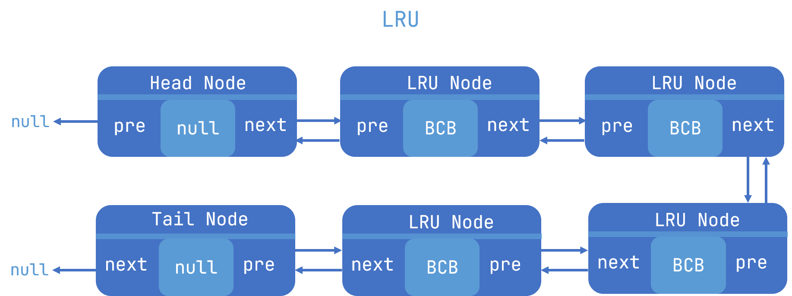
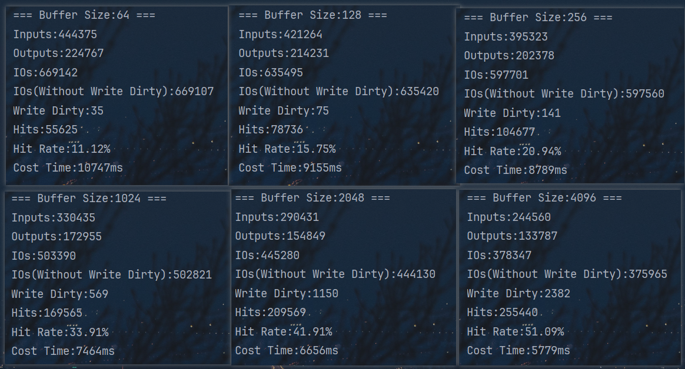

# Storage and Buffer Manager

> Author: [yubar](https://github.com/Yu-Bar) 
>
> Date: 2023.12.11

## 1 介绍

本项目设计并且实现了一个数据库**存储管理器**和**缓冲区管理器**

- 开发语言：JDK17

- 使用说明：整个项目无其他依赖，直接启动即可

  在 `com.yubar.adb.constant.Constant` 中可以修改块大小、缓冲区大小和总数据块数


## 2 设计

### 2.1 存储管理器设计

磁盘数据全部存储在resource目录下的 `data.dbf` 文件内

而文件由一个个容量为4096字节（默认值）的磁盘块组成，磁盘块逻辑上被定义为**索引块**和**数据块**两类，其中索引块位于数据文件的头部，作为后续全部磁盘块的索引块，采用密集索引结构

**索引块**定义为 `<页号，文件内部偏移地址>` 的键值对形式存储，每个项都采用int型变量，在JDK中该键值对占用8Byte，在一个索引块中可以存放512个索引项，50000个数据块共需要98个索引块，索引块之间采用连续存储形式

**数据块**只存储数据内容，不涉及页号等维护信息，同样也采用连续存储形式


### 2.2 缓冲管理器设计

1. 缓冲区

   frame使用byte数组来存储数据

   ```java
   public class Frame {
       private byte[] field;
   }
   ```

   使用一个Frame类型的数组来作为缓冲区

2. 缓冲区控制块(BCB)

   - `count ` 记录正在使用该frame的进程数量
   - `dirty` 标记该frame是否被写过
   - `next` 记录HASH槽上该BCB的下一个BCB（本项目使用拉链法处理哈希冲突）

   ```java
   public class BCB {
       public int pageId;
       public int frameId;
       public int count;
       public int dirty;
       public BCB next;
   }
   ```

3. LRU节点

   LRU链表是执行LRU替换算法所必需的数据结构。为了提高代码的可重用性，本项目使用具有头节点和尾节点的双线链表作为LRU链表的数据结构

   

   ```java
   public class LRUNode {
       public BCB curBCB;
       public LRUNode pre;
       public LRUNode next;
   }
   ```

4. pageId到BCB的HASH映射

   哈希函数为 `pageId % bufferSize`

   ```java
   private BCB[] pageToFrame;
   ```

   

   frameId到pageId的映射：在数组中存储每个frame对应的pageId就可以了

   ```java
   private int[] frameToPage;
   ```

   frameId到LRU节点的映射：在数组中存储每个frame对应的LRU节点地址就可以了、

   ```java
   private LRUNode[] frameToLRU;
   ```

### 2.3 执行流程


## 3 结果

### 3.1 设计结果 & 实现结果

本项目一共设计并实现了12个类

主类1个：`Application` 程序入口

常量类1个：`Constant` 用于统一管理程序的常量（块大小、缓冲区大小和总数据块数等）

实体类4个：`BCB` (缓冲控制块) 	`Frame` (缓存页) 	`LRUNode` (LRU节点) 	`TestCase` (测试用例实体) 

缓冲区管理器共涉及2个类：`Buffer` (接口) 	`BufferManager` (实现)

存储管理器涉共及2个类：`DataStorage` (接口) 	DataStorageManager` (实现)

工具类2个：`DBFactory` 用于初始化 `data.dbf` 文件	`Indicator` 用来记录和计算程序运行的各种指标（IO次数、命中率、运行时间等）


### 3.2 执行结果

默认条件下（BufferSize = 1024）：

- IO次数为503390次（除去最后write dirty的次数共有502821次）
- Buffer命中次数169563次，命中率为33.91% （命中次数/IO读写请求次数）

下面是不同Buffer Size下的执行情况

