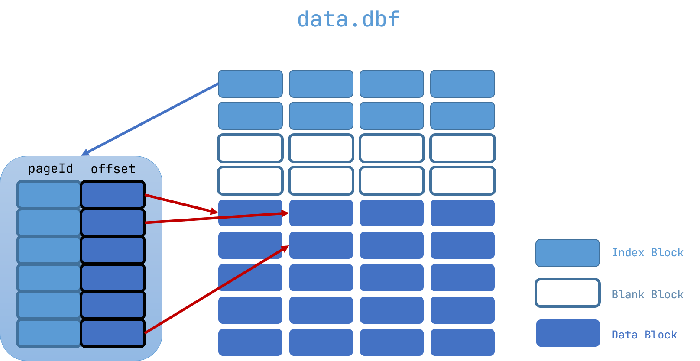
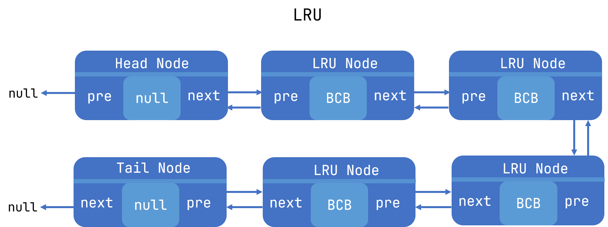
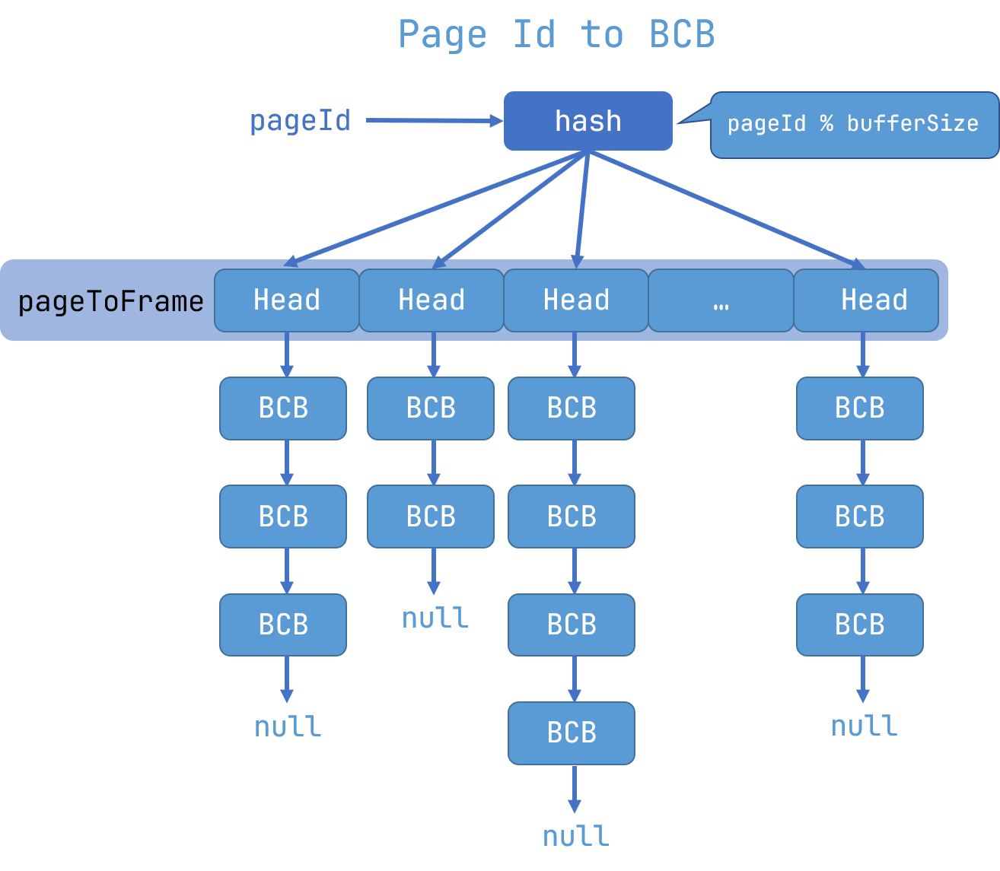
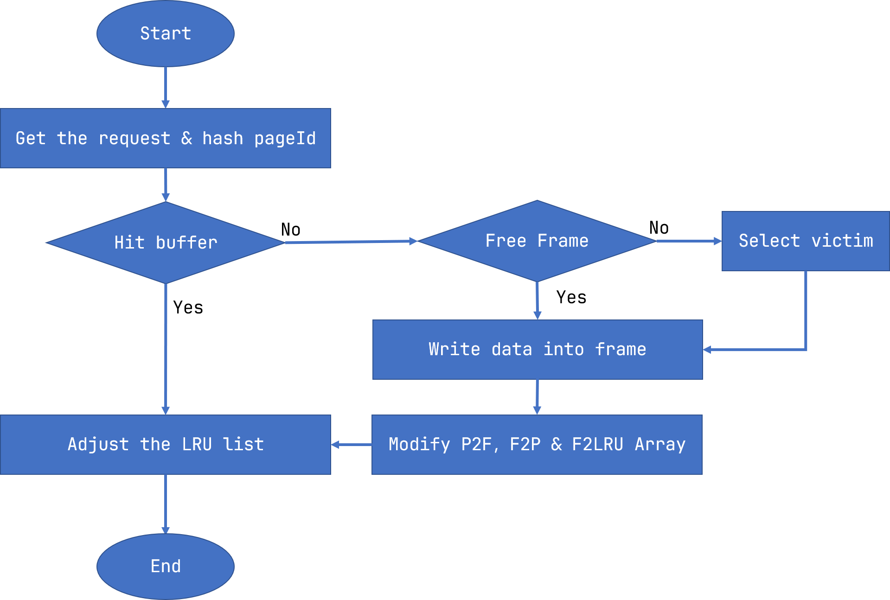
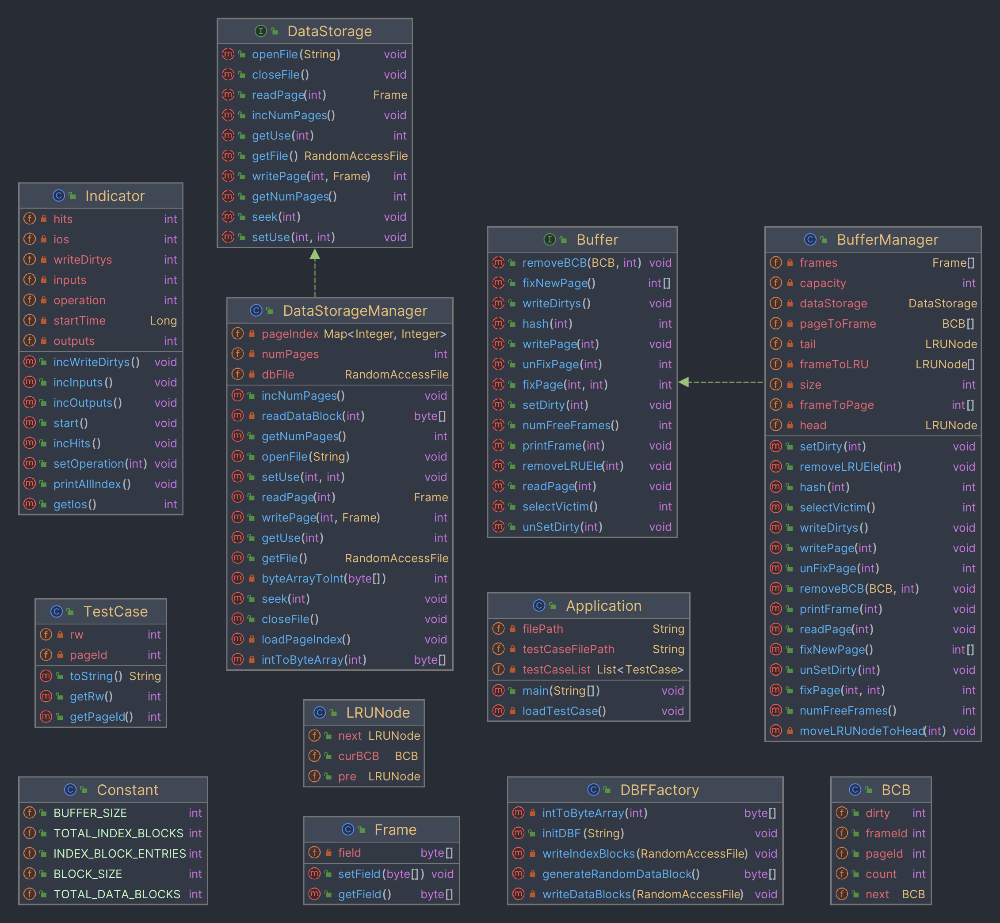
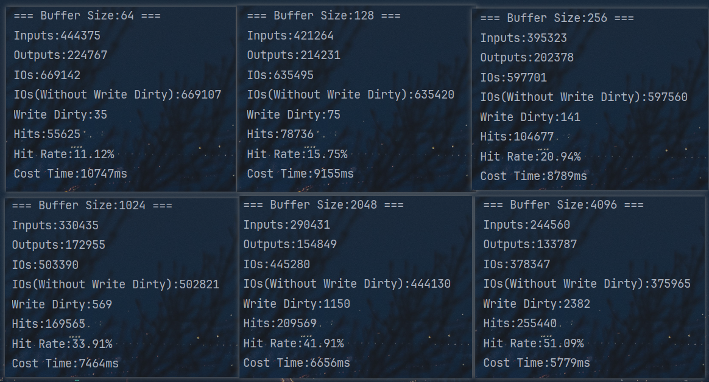

# Storage and Buffer Manager

> Author: [yubar](https://github.com/Yu-Bar) 
>
> Date: 2023.12.11

## 1 Introduction

This project designs and implements a database **storage manager** and **buffer manager**.

- Development language: JDK17

- Instructions for use: The whole project has no other extra dependence, and can be started only with jdk

In `com.yubar.adb.constant.Constant` , you can modify the block size, the buffer size and the total number of blocks.


## 2 Design

### 2.1 Storage Manager Design

All disk data is stored in the `data.dbf file`  in the resource directory.

The file is composed of many disk blocks with a capacity of 4096 bytes (default value). The disk block is logically defined as the **index block** and **data block**. The index block is located in the head of the data file. It records the index of all data disk blocks, using a dense index structure.

**Index block** are stored as key-value pairs in the form of  `< pageId, offset >`, both key and value is an  `int ` type variable, in the JDK the key-value pair occupies 8Byte. So, in an index block can store 512 index items, 50000 data blocks require 98 index blocks. Index blocks are stored consecutively.

**Data block** Only stores the data information, does not contain page number and other information.Data block are also stored consecutively.




### 2.2 Buffer Manager Design

1. Buffer

   frame store data with byte array.

   ```java
   public class Frame {
       private byte[] field;
   }
   ```

   We can use a Frame array as the buffer

2. BCB (Buffer Control Block)

   - `count ` Records the number of processes that are using the frame
   - `dirty` Marks whether the frame has been written
   - `next` Record the next BCB of this BCB on the HASH slot (this project uses "Chaining" to handle hash conflicts)

   ```java
   public class BCB {
       public int pageId;
       public int frameId;
       public int count;
       public int dirty;
       public BCB next;
   }
   ```

3. LRU Node

   An LRU linked list is a data structure necessary to perform the LRU algorithm. In order to improve the reusability of the code, this project uses a double linked list with head and tail nodes as the data structure of the LRU list.

   

   ```java
   public class LRUNode {
       public BCB curBCB;
       public LRUNode pre;
       public LRUNode next;
   }
   ```

4. pageId HASH to BCB

   The hash function is `pageId % bufferSize`

   ```java
   private BCB[] pageToFrame;
   ```

   

   Mapping from frameId to pageId: Store the corresponding pageId for each frame in an array.

   ```java
   private int[] frameToPage;
   ```

   Mapping from frameId to LRU node: Store the LRU node address of each frame in the array.

   ```java
   private LRUNode[] frameToLRU;
   ```

### 2.3 Flow Chart




## 3 Result

### 3.1 Design & Implementation Result

12 classes are designed and implemented in this project

1 Main class: `Application` The program entry

1 Constant class: `Constant`  Used to maintain the constant of this program (block size, buffer size, total number of data blocks, etc.)

4 entity classes: `BCB` (Buffer Control Block)	`Frame` (Cache Page)	 `LRUNode` (LRU Node)	 `TestCase` (Test Case Entity)

Buffer manager involves 2 classes: `Buffer` (interface) 	 `BufferManager` (implementation)

The storage manager consists of 2 classes: `DataStorage` (interface)	 `DataStorageManager` (implementation)

2 Tool classs: `DBFactory` for initializing 'data.dbf' file	 `Indicator` used to record and calculate indicators of this program (IO number, hit rate, run time, etc.)



### 3.2 Execution Result

By default (BufferSize = 1024) :

- The number of I/O is 503390. (Take away the number of dirty write, there is 502821)

- Buffer hits 169563 times, and the hit ratio is 33.91% (hits / IO requests)

Here's how it works with different Buffer sizes:

